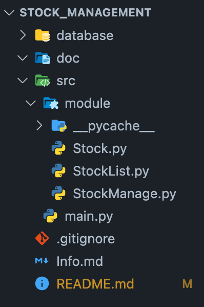

# 재고관리 프로그램  

## 작업 현황

### 구현 완료

- Save button with command
- Quit button with command
- Show All Data button with command
- Append button with command

### 구현 중  

- Window widget

### 미구현

- Search data
- change data

## 실행 시 주의 사항

- 코드 다운로드 폴더 내에 database란 이름의 폴더가 존재해야 함  
- 프로젝트 폴더 세팅을 다음과 같이 설정 할 것  

